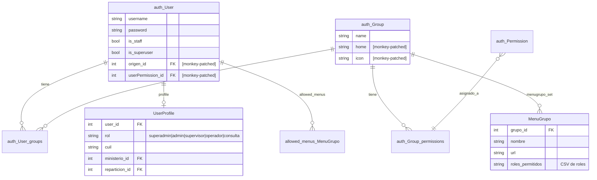

# Informe Técnico: Sistema de Autenticación, Roles y Grupos

## Proyecto: Sistema de Afiliaciones — Gobierno de Jujuy
### Fecha: 31/05/2026 | Versión del análisis: 1.0

---

## Índice

1. [Resumen ejecutivo](#1-resumen-ejecutivo)
2. [Arquitectura actual del sistema de usuarios](#2-arquitectura-actual-del-sistema-de-usuarios)
   - 2.1 [Modelos involucrados](#21-modelos-involucrados)
   - 2.2 [Flujo de autorización](#22-flujo-de-autorización)
   - 2.3 [Mecanismo de control de acceso: 3 niveles](#23-mecanismo-de-control-de-acceso-3-niveles)
   - 2.4 [Uso real de auth.Group en el proyecto vs. su propósito en Django](#24-uso-real-de-authgroup-en-el-proyecto-vs-su-propósito-en-django)
    - 2.5 [Relación entre UserProfile.Rol y auth.Group: dos mundos paralelos](#25-relación-entre-userprofilerol-y-authgroup-dos-mundos-paralelos)
    - 2.6 [Django admin expone permisos que el sistema no evalúa](#26-django-admin-expone-permisos-que-el-sistema-no-evalúa)
    - 2.7 [El origen del sistema custom: controlar el menú lateral](#27-el-origen-del-sistema-custom-controlar-el-menú-lateral)
3. [Esquema Django por defecto vs. Esquema del proyecto](#3-esquema-django-por-defecto-vs-esquema-del-proyecto)
   - 3.1 [Tabla comparativa](#31-tabla-comparativa)
   - 3.2 [Lo que Django ofrece y el proyecto no usa](#32-lo-que-django-ofrece-y-el-proyecto-no-usa)
   - 3.3 [Ausencia de documentación sobre mejora del sistema de roles](#33-ausencia-de-documentación-sobre-mejora-del-sistema-de-roles)
4. [Caso práctico: Incorporar un nuevo grupo con permisos](#4-caso-práctico-incorporar-un-nuevo-grupo-con-permisos)
   - 4.1 [Escenario](#41-escenario)
   - 4.2 [Implementación con Django por defecto](#42-implementación-con-django-por-defecto)
   - 4.3 [Implementación con el esquema actual del proyecto](#43-implementación-con-el-esquema-actual-del-proyecto)
   - 4.4 [Comparativa: agregar un rol vs. agregar un grupo](#44-comparativa-agregar-un-rol-vs-agregar-un-grupo)
5. [Implicancias en producción con alta concurrencia](#5-implicancias-en-producción-con-alta-concurrencia)
   - 5.1 [Problemas de rendimiento](#51-problemas-de-rendimiento)
   - 5.2 [Problemas de seguridad en concurrencia](#52-problemas-de-seguridad-en-concurrencia)
   - 5.3 [Problemas de mantenimiento en producción](#53-problemas-de-mantenimiento-en-producción)
6. [Recomendaciones](#6-recomendaciones)
   - 6.1 [Corto plazo (1-2 sprints)](#61-corto-plazo-implementable-en-1-2-sprints)
   - 6.2 [Mediano plazo (2-4 sprints)](#62-mediano-plazo-2-4-sprints)
   - 6.3 [Largo plazo (6+ meses)](#63-largo-plazo-6-meses)
7. [Anexo: Diagrama de modelos](#7-anexo-diagrama-de-modelos)
8. [Evaluación profunda: funcionalidades nativas de Django no aprovechadas](#8-evaluación-profunda-funcionalidades-nativas-de-django-no-aprovechadas)
   - 8.1 [Sistema de permisos de Django (completamente ignorado)](#81-sistema-de-permisos-de-django-completamente-ignorado)
   - 8.2 [Auth signals (no utilizadas)](#82-auth-signals-no-utilizadas)
   - 8.3 [Admin logging (LogEntry)](#83-admin-logging-logentry)
   - 8.4 [Admin site sin personalizar](#84-admin-site-sin-personalizar)
   - 8.5 [Features avanzados del admin no utilizados](#85-features-avanzados-del-admin-no-utilizados)
   - 8.6 [Django contrib apps ausentes](#86-django-contrib-apps-ausentes)
   - 8.7 [Auth forms de Django no utilizados](#87-auth-forms-de-django-no-utilizados)
   - 8.8 [75 vistas custom que replican el admin](#88-75-vistas-custom-que-replican-el-admin)

---

## 1. Resumen Ejecutivo

El sistema actual no reemplaza el módulo `django.contrib.auth` sino que lo **extiende** mediante dos mecanismos: (a) un modelo `UserProfile` con `OneToOneField` a `auth.User` que almacena un rol fijo de 5 valores posibles, y (b) **monkey-patching** de los modelos `User` y `Group` mediante `add_to_class()` para agregar campos extra directamente en las tablas del core de Django.

**Hallazgo principal:** El monkey-patching representa un riesgo arquitectónico grave en producción. Crea acoplamiento frágil con el ORM de Django, puede producir migraciones inconsistentes, y es incompatible con actualizaciones de versión de Django o con apps de terceros que interactúen con `auth.User`.

**Hallazgo secundario:** El proyecto construyó un sistema de autorización paralelo de 75 vistas custom en `administracion/views.py` que replica (con menor funcionalidad y mayor superficie de ataque) lo que Django admin y el sistema de permisos nativo ya proveen de forma probada y documentada. Esto incrementa el costo de mantenimiento, la curva de aprendizaje y la probabilidad de errores de seguridad.

**Contradicción crítica:** El Django admin (`/admin/panel_administrativo/`) **SÍ expone** los campos `user_permissions` y `group.permissions` (porque `CustomUserAdmin` hereda de `UserAdmin` y `GroupAdmin` nunca fue desregistrado), pero **ninguna vista del sistema verifica esos permisos**. Esto crea una falsa sensación de control: un administrador puede asignar permisos que parecen funcionales pero no tienen ningún efecto.

**Recomendación prioritaria:** Unificar el sistema de autorización eliminando el esquema paralelo y adoptando `auth.Permission` de Django como único mecanismo, respaldado por `@permission_required` y ``.

---

## 2. Arquitectura actual del sistema de usuarios

### 2.1 Modelos involucrados

```
auth.User (Django)
  ├── is_staff: bool
  ├── is_superuser: bool
  ├── groups: M2M -> auth.Group
  ├── user_permissions: M2M -> auth.Permission
  │
  ├── [MONKEY-PATCHED] origen: FK -> Origen
  ├── [MONKEY-PATCHED] userPermission: FK -> UserPermission (deprecated)
  └── [MONKEY-PATCHED] allowed_menus: M2M -> MenuGrupo
        │
        └── profile: OneToOneField -> UserProfile (administracion)
              ├── rol: CharField(TextChoices)
              │     SUPERADMIN, ADMINISTRADOR, SUPERVISOR, OPERADOR, CONSULTA
              ├── ministerio: FK -> Ministerio
              ├── reparticion: FK -> Reparticion
              ├── cuil: CharField(11)
              └── origen: CharField (MANUAL, SIAF, OTRO)

auth.Group (Django)
  └── [MONKEY-PATCHED] home: CharField
  └── [MONKEY-PATCHED] icon: CharField
        │
        └── menugrupo_set -> MenuGrupo (sistema)
              ├── roles_permitidos: CharField(200)  ← CSV de roles
              ├── nombre: CharField
              ├── url: CharField
              └── usuario_tiene_acceso(user): bool
```

### 2.2 Flujo de autorización

```
1. Usuario hace login
   └─> LoginConCaptchaView (valida reCAPTCHA opcional)
       └─> Django authenticate() + login()

2. Cada request
   └─> context_processors.user_allowed_menus(request)
       ├─> Obtiene groups del usuario
       ├─> Obtiene MenuGrupo de esos groups
       ├─> Filtra por allowed_menus (si existe)
       └─> Filtra por roles_permitidos (CSV -> profile.rol)

3. Vistas protegidas
   ├─> @login_required en URLs
   ├─> AdminRequiredMixin (verifica profile.es_admin)
   └─> Verificación manual de profile.rol en vistas
```

### 2.3 Mecanismo de control de acceso: 3 niveles

| Nivel | Qué verifica | Dónde | ¿Reemplaza a Django? |
|-------|-------------|-------|---------------------|
| 1 | Pertenencia a `auth.Group` | `context_processors.py:13` | No — usa Group de Django |
| 2 | `allowed_menus` individual | `context_processors.py:22-28` | Sí — reemplaza `user_permissions` |
| 3 | `roles_permitidos` en `MenuGrupo` | `sistema/models.py:53-63` | Sí — reemplaza permisos por ContentType |

El resultado: los permisos de Django (`auth.Permission`) **no se utilizan en ninguna vista del sistema**. Todo el control de acceso se basa en:
- Pertenencia a Group (como "módulo")
- Rol del UserProfile (como "nivel de acceso")
- Lista blanca de menús por usuario

---

### 2.4 Uso real de `auth.Group` en el proyecto vs. su propósito en Django

#### Propósito original de `auth.Group` en Django

El modelo `django.contrib.auth.models.Group` es un contenedor genérico de usuarios que incluye un campo `permissions` (M2M a `auth.Permission`) para **asignar permisos de forma masiva** a todos los miembros del grupo. Cada `Permission` está asociado a un modelo vía `ContentType` y representa una operación (add, change, delete, view) sobre ese modelo.

```python
# Así se usa Group en Django estándar:
group = Group.objects.create(name='Editores')
group.permissions.add(
    Permission.objects.get(codename='change_articulo'),
    Permission.objects.get(codename='view_articulo'),
)
# Ahora todos los usuarios en 'Editores' pueden cambiar y ver artículos
```

Los decoradores `@permission_required` y el template tag `` verifican directamente estos permisos contra los grupos del usuario, sin lógica adicional.

#### Uso real en el proyecto

En el proyecto actual, `auth.Group` se usa exclusivamente como **encabezado de módulo en el menú lateral (sidebar)**. Cada Group representa un módulo del sistema ("Administración", "Afiliaciones", "Servicios Web", etc.) y su único propósito es agrupar items de menú en la navegación.

El template `templates/menu.html` itera:

```
user.groups.all|dictsort:"name"       → encabezados colapsables del sidebar
  └─ grupo.menugrupo_set.all          → items de menú dentro de cada encabezado
       └─ MenuGrupo.roles_permitidos  → CSV de roles que pueden ver ese item
            └─ UserProfile.rol        → string único del usuario
```

**El campo `group.permissions` (M2M a `auth.Permission`) no se utiliza en absoluto.** La cadena completa es:

```
auth.Group → MenuGrupo.grupo (FK) → MenuGrupo.roles_permitidos (CSV) → UserProfile.rol
```

**Nunca**: `auth.Group.permissions` → `auth.Permission` → verificación en vista.

Group funciona como **etiqueta agrupadora de menús**, no como contenedor de permisos (que es su propósito original en Django).

#### Evidencia en el código

| Archivo | Línea | Evidencia |
|---------|-------|-----------|
| `sistema/context_processors.py` | 9-35 | Solo usa `user.groups.all()` para filtrar `MenuGrupo`, nunca consulta `group.permissions` |
| `sistema/models.py` | 53-63 | `MenuGrupo.usuario_tiene_acceso()` solo verifica `profile.rol in roles_permitidos` |
| `administracion/views.py` | 256-321 | La vista de permisos solo asigna `user.groups.set()` y `user.allowed_menus.set()`, nunca toca `group.permissions` |
| `administracion/forms.py` | 278-292 | `GroupForm` y `MenuGrupoForm` no exponen el campo `permissions` de Group |
| Todo el proyecto | — | No existe un solo `@permission_required` ni `user.has_perm()` ni `` en ninguna vista, URL o template |

#### Consecuencias

1. **Desperdicio del sistema de permisos de Django**: Django genera 4 permisos por modelo (`add_`, `change_`, `delete_`, `view_`) para todos los modelos registrados (descubiertos por `makemigrations`), pero estos nunca se asignan, consultan ni verifican. Ocupan espacio en la base de datos sin ser utilizados, mientras que el sistema paralelo (`roles_permitidos` + `allowed_menus`) duplica ese esfuerzo.

2. **Control de acceso insuficiente**: Si se necesita que un usuario pueda **ver** una solicitud pero no **crearla**, o que pueda **editar** pero no **eliminar**, el sistema actual no tiene forma de expresarlo. La única granularidad disponible es "ver el menú o no verlo".

3. **Duplicación de esfuerzo**: El proyecto implementó un sistema paralelo de permisos (`MenuGrupo.roles_permitidos` + `allowed_menus`) que replica (mal) lo que Django ya provee de forma nativa, probada y documentada.

---

### 2.5 Relación entre `UserProfile.Rol` y `auth.Group`: dos mundos paralelos

#### No hay herencia ni relación directa

`UserProfile.Rol` es una subclase de `TextChoices` (un enum de strings de Python), que se almacena como un `CharField(max_length=20)` en la tabla `administracion_userprofile`. No hereda de `auth.Group`, no tiene FK a `auth.Group`, no tiene M2M a `auth.Group`, ni ninguna relación a nivel de base de datos.

```python
# administracion/models.py:71-76
class Rol(models.TextChoices):
    SUPERADMIN = 'superadmin', 'Superadministrador'
    ADMINISTRADOR = 'administrador', 'Administrador'
    SUPERVISOR = 'supervisor', 'Supervisor'
    OPERADOR = 'operador', 'Operador'
    CONSULTA = 'consulta', 'Consulta'

# Esto es un simple CharField, no un FK a Group:
rol = models.CharField(max_length=20, choices=Rol.choices, default=Rol.OPERADOR)
```

#### El único puente: un `str.split(',')`

La única conexión entre `UserProfile.rol` (un string) y `auth.Group` (un modelo Django) ocurre en `MenuGrupo.usuario_tiene_acceso()`:

```python
# sistema/models.py:53-63
def usuario_tiene_acceso(self, user):
    if not self.roles_permitidos:
        return True  # ← Si el CSV está vacío, todos acceden (fail-open)
    profile = getattr(user, 'profile', None)
    if not profile:
        return False
    roles = [r.strip() for r in self.roles_permitidos.split(',') if r.strip()]
    return profile.rol in roles  # ← Único punto de conexión: comparación de strings
```

Es decir:

1. `auth.Group` contiene `MenuGrupo` (vía FK `grupo`)
2. `MenuGrupo` tiene un `CharField` llamado `roles_permitidos` con valores como `"supervisor,administrador,superadmin"`
3. En cada request, se parsea ese string con `split(',')`
4. Se compara contra `user.profile.rol` (otro string)

No hay FK, no hay M2M, no hay `ContentType`, no hay integridad referencial. Es **exclusivamente matching de strings**.

#### Inconsistencias que esto genera

| Situación | Resultado |
|-----------|-----------|
| Un `Group` "Afiliaciones" tiene 10 usuarios con 4 roles distintos | Permitido. No hay validación cruzada. |
| Se escribe mal el rol en `roles_permitidos`: `"adminstrador"` | El menú no se muestra. Nadie recibe una alerta. |
| Se cambia `UserProfile.rol` de un usuario | Los `MenuGrupo.roles_permitidos` no se actualizan automáticamente. |
| Un usuario está en 3 Groups, cada uno con su `MenuGrupo` | Los menús se acumulan, pero el rol es UNO solo para todos. |
| Se agrega un nuevo rol al `TextChoices` | Los `roles_permitidos` existentes no lo incluyen automáticamente. |

#### Problema de diseño: 1 rol vs. N grupos

Cada usuario tiene **exactamente un rol** (`UserProfile.rol` es un `CharField`, no un M2M). Pero puede pertenecer a **N grupos** de Django. Esto significa que:

- Si un usuario necesita permisos combinados (ej. operador en un módulo, supervisor en otro), **no puede** con el esquema actual.
- La única solución sería crear roles híbridos (`OPERADOR_SUPERVISOR`, `ADMIN_CONSULTA`, etc.), lo que escala cuadráticamente: con 5 roles base hay 25 combinaciones posibles de a pares, 125 de a tres, etc. Cada combinación requiere modificar el `TextChoices`, crear una migración y hacer deploy.
- En Django estándar, esto se resuelve simplemente asignando al usuario a los grupos correspondientes: `user.groups.add(grupo_operador, grupo_supervisor)`. Sin deploy, sin migración, sin código nuevo.

---

### 2.6 Django admin expone permisos que el sistema no evalúa

#### La contradicción

El proyecto monta el Django admin en `/admin/panel_administrativo/` (`config/urls.py:21`) y registra `User` mediante `CustomUserAdmin(UserAdmin)` en `sistema/admin.py:374-375`. Como `CustomUserAdmin` extiende `UserAdmin`, hereda automáticamente:

```python
# Django UserAdmin por defecto:
filter_horizontal = ('groups', 'user_permissions',)
fieldsets = (
    (None, {'fields': ('username', 'password')}),
    (_('Personal info'), {'fields': ('first_name', 'last_name', 'email')}),
    (_('Permissions'), {
        'fields': ('is_active', 'is_staff', 'is_superuser', 'groups', 'user_permissions'),
    }),
    ...
)
```

Además, `GroupAdmin` nunca fue desregistrado, por lo que el Django admin también expone `group.permissions` con su `filter_horizontal = ('permissions',)`.

**Esto significa que el Django admin permite:**

| Acción | Disponible en admin | ¿Tiene efecto real? |
|--------|:-------------------:|:-------------------:|
| Asignar `auth.Permission` a un usuario (`user.user_permissions`) | ✅ Sí | ❌ No — ninguna vista lo verifica |
| Asignar `auth.Permission` a un grupo (`group.permissions`) | ✅ Sí | ❌ No — ninguna vista lo verifica |
| Asignar grupos (módulos) a un usuario | ✅ Sí | ✅ Sí — filtra `MenuGrupo` |
| Asignar menús a un usuario | ❌ No (solo en custom admin) | ✅ Sí |

#### La falsa sensación de control

Un administrador que acceda al Django admin (`/admin/panel_administrativo/auth/user/`) verá:

- Un campo `user_permissions` con `filter_horizontal` (doble lista con búsqueda)
- Un campo `groups` con `filter_horizontal`
- En la edición de grupos, un campo `permissions` igualmente funcional

Si este administrador asigna permisos a un usuario o grupo, la operación se ejecutará correctamente en la base de datos (se insertarán registros en `auth_user_user_permissions` o `auth_group_permissions`). **Pero ninguna vista, template, decorador o middleware del proyecto verifica esos permisos.** El sistema solo revisa `UserProfile.rol` + `MenuGrupo.roles_permitidos` + `allowed_menus`.

#### Evidencia de la falta de verificación

| Patrón de Django | Usos en el proyecto |
|-----------------|:------------------:|
| `@permission_required` | **0** |
| `PermissionRequiredMixin` | **0** |
| `user.has_perm()` / `user.has_perms()` | **0** |
| `user.get_all_permissions()` / `user.get_group_permissions()` | **0** |
| `` / `perms.` en templates | **0** |
| `user_permissions` asignado desde vistas | **0** |
| `group.permissions` asignado desde vistas | **0** |

#### Riesgo concreto

Un administrador que conozca el Django admin podría:

1. Asignar `view_solicitud` a un usuario pensando que le da acceso a ver solicitudes
2. El usuario seguirá sin poder ver solicitudes si su `UserProfile.rol` no está en el `roles_permitidos` del `MenuGrupo` correspondiente
3. No hay feedback de error, ni log, ni advertencia de que el permiso asignado no tiene efecto
4. El administrador pierde tiempo debuggeando un problema que el sistema mismo creó

---

### 2.7 El origen del sistema custom: controlar el menú lateral

#### Objetivo original

El sistema custom (`MenuGrupo.roles_permitidos` + `allowed_menus` + context processors) fue creado con un **solo propósito**: individualizar qué items del menú lateral (sidebar) ve cada usuario en `templates/menu.html`. Nada más.

`auth.Group` se usa como encabezado de módulo, `MenuGrupo.roles_permitidos` filtra por rol, y `allowed_menus` permite una lista blanca por usuario. El sidebar resultante se renderiza en `menu.html` con este flujo:

```
groups del usuario  →  MenuGrupo de esos groups  →  filtro por allowed_menus  →  filtro por rol (CSV)
```

#### Crecimiento por acreción

Ese mecanismo de menú, por **falta de un sistema de autorización real**, terminó siendo el **único control de acceso de todo el proyecto**. Al no existir `@permission_required`, `user.has_perm()` ni ``, el sistema de menú asumió por defecto la responsabilidad de decidir qué puede hacer un usuario dentro de cada vista.

| Responsabilidad original (menú) | Responsabilidad adquirida (autorización) |
|-------------------------------|----------------------------------------|
| Qué items del sidebar ve el usuario | Qué puede crear, editar, eliminar el usuario |
| Agrupación visual de funcionalidades | Control de acceso a vistas y datos |
| Navegación | Permisos granulares sobre modelos |

#### La solución correcta en Django

Django ya provee todo lo necesario para autorización a nivel de template sin necesidad del stack custom:

```django

  <li><a href="">Solicitudes</a></li>


  <li><a href="">Nueva Solicitud</a></li>

```

`{{ perms }}` es provisto por `django.contrib.auth.context_processors.auth.PermWrapper` — un context processor nativo de Django que **ya está incluido** en `TEMPLATES.OPTIONS.context_processors` del proyecto (línea 76 de `settings.py`). No requiere código adicional, ni `MenuGrupo`, ni `roles_permitidos` CSV, ni `allowed_menus`, ni variables `es_*` inyectadas manualmente.

Para la agrupación visual por módulo, bastaría usar `ContentType` o `django.contrib.contenttypes` para agrupar modelos por app. Django admin ya hace esto nativamente.

#### Lo que se podría eliminar si se adopta el enfoque de Django

| Componente | Archivo | Líneas aprox. |
|-----------|---------|:------------:|
| `MenuGrupo` model (con `roles_permitidos` CSV) | `sistema/models.py` | ~35 líneas |
| `usuario_tiene_acceso()` method | `sistema/models.py` | ~10 líneas |
| `allowed_menus` M2M (monkey-patched) | `sistema/models.py` | 1 línea |
| `user_allowed_menus` context processor | `sistema/context_processors.py` | 5 líneas |
| `_get_visible_menu_ids` helper | `sistema/context_processors.py` | ~28 líneas |
| `user_profile_context` context processor | `sistema/context_processors.py` | ~32 líneas |
| `MenuGrupo` admin, form, CRUD views | Múltiples archivos | ~120 líneas |
| Variables `es_*` en templates condicionales | Todos los templates | ~50+ apariciones |
| `Group` monkey-patching (`home`, `icon`) | `sistema/models.py` | 2 líneas |

**Total estimado: ~280 líneas de código que podrían eliminarse**, reduciendo superficie de ataque, queries por request y complejidad arquitectónica.

---

## 3. Esquema Django por defecto vs. Esquema del proyecto

### 3.1 Tabla comparativa

| Aspecto | Django por defecto | Proyecto actual |
|---------|-------------------|-----------------|
| Modelo de usuario | `auth.User` | `auth.User` + `UserProfile` (1:1) + monkey-patching |
| Grupos | `auth.Group` con `permissions` M2M | `auth.Group` + monkey-patching (home, icon) |
| Permisos | `auth.Permission` por ContentType (add/change/delete/view) | No usado. Se usa `UserProfile.rol` + `MenuGrupo.roles_permitidos` |
| Roles | No existe nativamente (se simula con Group) | `UserProfile.Rol` con 5 valores fijos (TextChoices) |
| Granularidad | A nivel de modelo + objeto (con librerías) | Solo a nivel de menú (ver/no ver) |
| Flexibilidad | Alta — permisos combinables | Baja — roles fijos y excluyentes |
| Seguridad de permisos | Probada por 15+ años en producción | Sin probar en alta concurrencia |
| Migraciones estables | Sí | No (monkey-patching frágil) |
| Compatibilidad third-party | Total | Parcial (apps que toquen auth.User pueden fallar) |
| Curva de aprendizaje | Estándar (cualquier dev Django) | Propietaria (solo el equipo actual conoce) |
| Relación Rol/Group | Unificación natural: Group hereda permisos, el usuario hereda de Group | Dos mundos paralelos conectados únicamente por `str.split(',')` en `roles_permitidos` |
| Asignación de permisos | `user.groups.add(group)` + `group.permissions.add(permiso)` — 2 operaciones estándar | `user.groups.add(group)` + `user.allowed_menus.add(menu)` + escribir CSV + verificar `profile.rol` en cada vista — 4 pasos manuales |
| Documentación de mejora | Abundante: docs oficiales, libros, comunidades, Stack Overflow | Ninguna: no existe guía de migración, ROADMAP, ni documento que explique las limitaciones del esquema actual |
| Permisos en admin de Django | Asignables a usuarios y grupos mediante `filter_horizontal` en el admin, **y verificados** por `@permission_required` en vistas | Asignables en el admin (heredado de `UserAdmin`/`GroupAdmin`), **pero nunca verificados** por ninguna vista del proyecto |
| Auth signals | Disparadas por login/logout/fallos, conectables a audit logging | 0 suscriptores — no se usan señales de auth en todo el proyecto |
| Admin logging (`LogEntry`) | Django registra automáticamente cada creación/edición/eliminación en `django_admin_log` | 0 referencias — no se usa el log nativo de admin ni se implementó un reemplazo |
| Cantidad de vistas de gestión | Las provistas por `django.contrib.admin` (~10 vistas base) | **75 vistas custom** en `administracion/views.py` que replican funcionalidad del admin |
| Auth forms estándar | `PasswordResetForm`, `SetPasswordForm`, `AdminPasswordChangeForm`, `UserCreationForm`, `UserChangeForm` | 0 usos — reset de password implementado manualmente, formulario de usuario custom |
| `django.contrib.admindocs` | Documentación automática de URLs, modelos, templates y vistas | No está en `INSTALLED_APPS` |
| `django.contrib.humanize` | Filtros de template para formatear fechas, números, tamaños | No está en `INSTALLED_APPS` |

### 3.2 Lo que Django ofrece y el proyecto no usa

Django `auth.Permission` permite:
- **4 permisos por modelo** (`add_`, `change_`, `delete_`, `view_`)
- **Asignación por grupo o por usuario**
- **Verificación en vistas** con `@permission_required` o `PermissionRequiredMixin`
- **Verificación en templates** con ``
- **Verificación a nivel de objeto** con `has_perm()` y `has_perms()` (con librerías como `django-guardian`)
- **Integración con el admin de Django** automática

El proyecto no usa nada de esto. En su lugar, creó un sistema paralelo basado en:
- `MenuGrupo.roles_permitidos` (campo CSV, frágil)
- `user_profile_context` (context processor que expone el rol a todos los templates)

---

### 3.3 Ausencia de documentación sobre mejora del sistema de roles

El proyecto no contiene **ninguna documentación técnica** que describa cómo:

- Migrar del esquema actual (`roles_permitidos` CSV) a un sistema con integridad referencial
- Agregar un nuevo rol al `TextChoices` de `UserProfile` (no hay guía de pasos)
- Reemplazar el `CharField` CSV por una tabla intermedia, M2M o usar `auth.Permission` directamente
- Utilizar `auth.Permission` de Django como alternativa al sistema actual
- Escalar el modelo de roles más allá de los 5 valores fijos actuales

#### Documentación existente vs. lo que falta

| Documento | ¿Menciona roles? | ¿Explica limitaciones? | ¿Propone mejora? |
|-----------|:----------------:|:----------------------:|:----------------:|
| `README.md` | Sí (enumera los 5 roles) | No | No |
| `SETUP.md` | No | No | No |
| `CONTRIBUTING.md` | No | No | No |
| `AGENTS.md` | Sí (menciona roles en middleware y context processors) | No | No |
| `GIT_GUIA.md` | No | No | No |
| `OPENCODE.md` | No | No | No |
| `plansPendientes.md` | No (solo bugs de UI) | No | No |
| Código fuente (`models.py`, `views.py`) | Sí (implementación) | No (sin comentarios sobre limitaciones) | No (sin TODO/FIXME sobre el diseño) |

#### Implicancias de esta ausencia

1. **Ingeniería inversa obligatoria**: Cualquier developer que quiera entender, modificar o mejorar el sistema de permisos debe leer el código completo de `UserProfile`, `MenuGrupo`, los context processors, el middleware y las vistas para reconstruir mentalmente cómo opera el sistema. No hay un documento de arquitectura que lo explique.

2. **Riesgo alto al refactorizar**: Sin documentación que describa el comportamiento esperado, cualquier cambio en el sistema de roles puede romper la seguridad existente sin que el desarrollador lo advierta hasta que un usuario reporte que no puede acceder a una funcionalidad.

3. **Dependencia del conocimiento tácito**: La comprensión completa del sistema de seguridad reside en la memoria de los desarrolladores originales. Si el equipo cambia, ese conocimiento se pierde.

4. **Sin trazabilidad de decisiones**: No hay registro de por qué se optó por `roles_permitidos` como CSV en lugar de una relación M2M o usar `auth.Permission`. Esto dificulta evaluar si esa decisión sigue siendo válida.

5. **Sin plan de evolución**: No existe un `ROADMAP.md`, `HACKING.md`, `ARCHITECTURE.md` ni ningún otro artefacto que trace un plan de evolución del subsistema de autenticación y autorización.

---

## 4. Caso práctico: Incorporar un nuevo grupo con permisos

### 4.1 Escenario

> **Requisito:** Crear un grupo "Auditores" que solo pueda ver solicitudes de afiliación y sus informes asociados, pero no crear, editar ni eliminar. Además, debe tener acceso a un menú "Auditoría" en el panel principal.

---

### 4.2 Implementación con Django por defecto

```python
# 1. Crear el Group (shell o migración data migration)
from django.contrib.auth.models import Group, Permission
from django.contrib.contenttypes.models import ContentType
from afiliaciones.models import Solicitud, Informe

group, _ = Group.objects.get_or_create(name='Auditores')

# 2. Obtener permisos específicos
ct_solicitud = ContentType.objects.get_for_model(Solicitud)
ct_informe = ContentType.objects.get_for_model(Informe)

permisos = Permission.objects.filter(
    content_type__in=[ct_solicitud, ct_informe],
    codename__in=['view_solicitud', 'view_informe']
)
group.permissions.set(permisos)

# 3. Asignar usuario al grupo
user.groups.add(group)

# 4. Proteger vistas con decorador
from django.contrib.auth.decorators import permission_required

@permission_required('afiliaciones.view_solicitud')
def detalle_solicitud(request, pk):
    ...

# 5. Verificar en template

    <a href="">Ver</a>

```

**Ventajas:**
- 5 líneas de código, todo estándar
- Los permisos se migran con `python manage.py migrate`
- Cualquier dev Django entiende el patrón
- Herramientas como `django-admin` ya soportan la asignación visual

**Desventajas:**
- Los permisos por ContentType son a nivel de modelo, no de instancia (todos ven todas las solicitudes)
- Para permisos por objeto se necesita `django-guardian` u otra librería

---

### 4.3 Implementación con el esquema actual del proyecto

```python
# PASO 1: Crear el Group de Django (módulo)
from django.contrib.auth.models import Group
group = Group.objects.create(name='Auditores')

# PASO 2: Crear el MenuGrupo asociado
from sistema.models import MenuGrupo
menu = MenuGrupo.objects.create(
    grupo=group,
    nombre='Auditoría',
    url='/auditoria/',
    icon='fa-solid fa-clipboard',
    roles_permitidos='supervisor,administrador,superadmin',  # ← CSV string
    orden=10
)

# PASO 3: Asignar grupo al usuario
user.groups.add(group)
# Adicional: si el usuario tiene allowed_menus configurado,
# hay que agregar este menú también:
user.allowed_menus.add(menu)  # ← monkey-patched field

# PASO 4: En las vistas, verificar rol manualmente
def detalle_solicitud(request, pk):
    profile = getattr(request.user, 'profile', None)
    if not profile or profile.rol not in ['supervisor', 'administrador', 'superadmin']:
        return HttpResponseForbidden()
    ...

# PASO 5: En template, verificar con variable de contexto

    <a href="">Ver</a>

```

**Problemas de este enfoque:**

| # | Problema | Detalle |
|---|----------|---------|
| 1 | **Roles fijos en CSV** | `roles_permitidos` es un `CharField` con valores separados por coma. No hay integridad referencial, no hay validación de que el rol exista, y cualquier error tipográfico rompe el acceso. |
| 2 | **Acoplamiento a 5 roles** | Si se crea el rol "auditor", no hay manera de usarlo porque `UserProfile.Rol` es un `TextChoices` fijo en código. Habría que modificar el modelo, crear migración, y actualizar todos los CSV de `roles_permitidos` en la base de datos. |
| 3 | **Dos puntos de asignación** | El usuario debe estar en el Group **y** en `allowed_menus` (si está configurado). Esto duplica la lógica y es fuente de errores. |
| 4 | **Verificación manual en vistas** | No hay `@permission_required` ni nada similar. Cada vista debe verificar `profile.rol` manualmente, lo que lleva a olvidos y brechas de seguridad. |
| 5 | **Sin granularidad** | Si un "auditor" puede ver solicitudes pero no informes, no hay manera de expresarlo sin crear otro MenuGrupo o agregar lógica ad-hoc. |

---

### 4.4 Comparativa: agregar un rol vs. agregar un grupo

#### Agregar un rol nuevo al esquema actual (ej: "AUDITOR")

Para incorporar un nuevo valor a `UserProfile.Rol.TextChoices`, se requieren los siguientes pasos:

| # | Paso | Archivo | ¿Requiere deploy? | Riesgo |
|---|------|---------|:-----------------:|:------:|
| 1 | Modificar `class Rol(models.TextChoices)` agregando `AUDITOR = 'auditor', 'Auditor'` | `administracion/models.py` | Sí | Alto — error tipográfico en el valor |
| 2 | Crear migración: `makemigrations administracion` | CLI | Sí | Medio — migración automática |
| 3 | Agregar propiedad `es_auditor` a `UserProfile` | `administracion/models.py` | Sí | Bajo |
| 4 | Agregar variable `es_auditor` al context processor | `sistema/context_processors.py` | Sí | Bajo |
| 5 | Actualizar **todos** los `MenuGrupo.roles_permitidos` en DB que deban incluir "auditor" | Admin o SQL | Sí | Alto — si se omite uno, el menú queda invisible |
| 6 | Modificar **cada** vista que deba aceptar el nuevo rol (agregar `'auditor'` a las listas de roles permitidos) | Múltiples `views.py` | Sí | Alto — si se olvida una vista, hay una brecha de seguridad |
| 7 | Ejecutar migraciones y deploy | CLI + servidor | Sí | Alto — ventana de indisponibilidad |

**Total: 7 pasos. Todos requieren deploy. Tiempo estimado: 2-5 días hábiles (codificar + testear + deploy).**

#### Agregar un grupo nuevo con Django estándar

| # | Paso | ¿Requiere deploy? | Riesgo |
|---|------|:-----------------:|:------:|
| 1 | Crear el `Group` desde el admin de Django | No | Bajo |
| 2 | Seleccionar los permisos deseados (`view_solicitud`, `view_informe`, etc.) | No | Bajo |
| 3 | Asignar usuarios al grupo desde el admin | No | Bajo |
| 4 | (Opcional) Agregar `@permission_required` en vistas si no existe | Sí (solo si la vista no está protegida) | Bajo |

**Total: 1-2 pasos obligatorios. Deploy solo si las vistas no están ya protegidas con decoradores estándar. Tiempo estimado: 5-30 minutos.**

#### Tabla resumen

| Aspecto | Agregar rol (esquema actual) | Agregar grupo (Django) |
|---------|:----------------------------:|:----------------------:|
| Pasos obligatorios | 7 | 1-2 |
| Requiere modificar código | Sí (modelo, context processor, vistas) | No (solo admin) |
| Requiere migración | Sí (`makemigrations` + `migrate`) | No |
| Requiere deploy | Sí | No* |
| Tiempo estimado | 2-5 días | 5-30 min |
| ¿Afecta a otros roles/grupos? | Sí (hay que actualizar todos los CSV) | No |
| ¿Afecta a usuarios existentes? | Sí (cambia el modelo, riesgo de datos) | No |
| ¿Se puede revertir? | Sí (migración hacia atrás + deploy) | Sí (desmarcar en admin) |
| ¿Error humano posible? | Alto (7 pasos manuales, fácil omitir uno) | Bajo (interfaz guiada) |
| Capacitación requerida | Conocimiento profundo del código | Admin básico de Django |

\* *Solo requiere deploy si las vistas no usan `@permission_required`. Si ya lo usan, el nuevo permiso funciona inmediatamente después de crearlo desde el admin.*

#### Conclusión

El esquema actual penaliza fuertemente la incorporación de nuevos perfiles: cada nuevo rol requiere una cadena completa de modificaciones en código, migraciones y deploy. Esto desalienta la creación de roles especializados y fuerza al sistema a operar con solo 5 roles genéricos, independientemente de la complejidad real de los flujos de trabajo.

En un sistema con muchos usuarios concurrentes y perfiles diversos (como este), la inflexibilidad del esquema de roles obliga a los administradores a asignar permisos "por exceso" (dar un rol más permisivo del necesario) para compensar la falta de granularidad, lo que constituye una violación del principio de **mínimo privilegio**.

---

## 5. Implicancias en producción con alta concurrencia

### 5.1 Problemas de rendimiento

| Componente | Impacto | Explicación |
|-----------|---------|-------------|
| `user_allowed_menus` por request | 🔴 Alto | Se ejecuta en **cada request** para **todos los usuarios autenticados**. Consulta: groups del usuario → MenuGrupo → allowed_menus → roles_permitidos. Con N usuarios concurrentes, son N+1 queries por request. |
| `user_profile_context` por request | 🟡 Medio | Agrega 1 query extra (`profile`) por request. Con Django cached auth esto se mitiga, pero no hay caché explícita. |
| `roles_permitidos` como CSV | 🟡 Medio | El parseo de CSV en cada request para cada menú visible agrega overhead de CPU. Con miles de requests/minuto, es medible. |
| Monkey-patching en import | 🔴 Alto | `User.add_to_class()` se ejecuta al **importar `sistema.models`**. En producción con Gunicorn (multiple workers), esto ocurre N veces al arrancar. Si hay conflictos de importación, los workers pueden fallar silenciosamente. |

### 5.2 Problemas de seguridad en concurrencia

| Escenario | Riesgo |
|-----------|--------|
| **Race condition en asignación de permisos** | Si un admin asigna un menú a un usuario mientras ese usuario está operando, la sesión actual puede tener permisos inconsistentes (mitad viejos, mitad nuevos). Django `Permission` mitiga este problema usando transacciones atómicas y row-level locking en la base de datos al asignar permisos mediante `group.permissions.set()`. |
| **Cache de permisos desactualizada** | El sistema actual no cachea `allowed_menus` ni `roles_permitidos`. Si en el futuro se agrega caché, puede haber ventanas donde un usuario vea menús que ya no debería ver (o viceversa). |
| **Inconsistencia group/rol** | Si se cambia `UserProfile.rol` de un usuario, pero los `MenuGrupo.roles_permitidos` no se actualizan, el usuario puede perder acceso a todo sin saber por qué. No hay señales ni hooks que mantengan la consistencia. |
| **Storm de login en fuerza bruta** | Sin rate limiting, 1000 requests concurrentes de login pueden agotar conexiones de DB y CPU mientras Django intenta verificar contraseñas. |
| **Error humano en CSV** | Un admin escribe mal un rol en `roles_permitidos` ("administrador" vs "adminstrador") y un grupo entero de usuarios pierde acceso. No hay validación ni alerta. |

### 5.3 Problemas de mantenimiento en producción

| Situación | Con Django auth | Con el esquema actual |
|-----------|----------------|----------------------|
| Agregar un permiso nuevo | `python manage.py migrate` (se genera automáticamente) | Editar modelo + migración + actualizar CSV en DB + deploy |
| Actualizar Django (ej. 5.1 → 5.2) | `pip install -U Django` (backward compatible) | Puede romper si `add_to_class()` cambia internamente |
| Contratar nuevo dev | Ya sabe Django auth | Curva de aprendizaje de 1-2 semanas |
| Auditar permisos | `auth_permission` + `auth_group_permissions` tablas SQL simples | 6+ tablas relacionadas con lógica CSV |
| Debuggear acceso denegado | `has_perm()` retorna False con causa clara | Múltiples puntos de fallo sin trazabilidad |

---

## 6. Recomendaciones

### 6.1 Corto plazo (implementable en 1-2 sprints)

1. **Documentar el plan de migración**: Crear un `ROADMAP-auth.md` que describa los pasos concretos para reemplazar `roles_permitidos` CSV por una relación M2M con integridad referencial, o migrar a `auth.Permission` de Django. Incluir script de migración de datos, rollback plan, y testing de regresión de acceso.

2. **Eliminar monkey-patching de campos en auth.User/Group**: Los campos `origen`, `userPermission` y `allowed_menus` agregados con `add_to_class()` a `auth.User`, y `home`/`icon` agregados a `auth.Group`, deben migrarse a `UserProfile` (que ya existe) y a un modelo separado para los datos de Group. Esto elimina la fragilidad en imports y migraciones sin requerir un `AUTH_USER_MODEL` personalizado (eso queda para largo plazo). Data migration para trasladar datos existentes.

3. **Cifrar contraseñas SMTP**: Reemplazar `base64` con Fernet (`cryptography.fernet`) usando clave en `credenciales.py`.

4. **Agregar rate limiting**: `django-axes` o `django-ratelimit` para proteger login contra fuerza bruta. Configurar bloqueo de IP tras 5 intentos fallidos en 15 minutos.

5. **Forzar POST en logout**: Cambiar `logout_view` para aceptar solo POST.

### 6.2 Mediano plazo (2-4 sprints)

6. **Migrar permisos a Django estándar**: Los `Permission` en Django requieren un `ContentType` asociado (cada permiso pertenece a un modelo). Para los menús, se puede usar un modelo proxy (ej. `class MenuPermission(models.Model): class Meta: proxy=True` o un modelo con `managed=False`) que sirva como contenedor de ContentType, o bien mapear cada `MenuGrupo` a un permiso usando `ContentType.objects.get_for_model()`. La migración debe transferir la lógica de `MenuGrupo.roles_permitidos` a `auth.Group.permissions`, permitiendo usar `@permission_required` y `` en templates, unificar el sistema de autorización y eliminar el CSV.

7. **Desacoplar Rol de Group**: Reemplazar el `TextChoices` fijo de `UserProfile.rol` por una relación M2M a `auth.Group`, usando `auth.Group` como contenedor natural de roles (ya existe, no requiere nuevo modelo). Cada Group representa un rol con sus permisos asociados vía `group.permissions`. Esto permite que un usuario tenga múltiples roles simultáneamente (ej. operador + supervisor en distintos módulos). Alternativa: crear un modelo `Rol` independiente con su propia M2M a `Permission` si se necesita más flexibilidad que la que ofrece `Group`. En cualquier caso, eliminar el `CharField` con `TextChoices` para permitir roles dinámicos desde el admin sin código ni deploy.

8. **Cachear menús por rol**: Agregar cache (Redis o Memcached) para `user_allowed_menus` con invalidación al modificar `MenuGrupo` o `UserProfile.rol`.

9. **Implementar señales de consistencia**: `post_save` en `UserProfile` que verifique `MenuGrupo.roles_permitidos` y loguee advertencias si hay discrepancias. `pre_save` en `MenuGrupo` que valide que los roles en `roles_permitidos` existan realmente.

10. **Crear decorador `@role_required`**: Centralizar la verificación de roles en lugar de tenerla dispersa en vistas, como paso intermedio antes de migrar completamente a `@permission_required`.

11. **Evaluar reducción de vistas custom**: Identificar qué CRUDs en `administracion/views.py` pueden migrarse al Django admin o a vistas genéricas basadas en permisos. Priorizar los CRUDs geográficos (departamentos, municipios, localidades, escuelas — 14 vistas) y los CRUDs de configuración (módulos, menús, perfiles — 15 vistas) que no tienen lógica de negocio especializada. Estimar reducción de líneas de código y superficie de ataque.

12. **Configurar `site_header`, `site_title`, `index_title`**: Personalizar el Django admin para que coincida con el branding del proyecto. Agregar un override de `admin/login.html` si se desea consistencia visual.

13. **Agregar `django.contrib.humanize`**: Incluir en `INSTALLED_APPS` para usar filtros como `naturaltime`, `intcomma` e `intword` en templates.

14. **Suscribirse a auth signals**: Conectar `user_logged_in` y `user_login_failed` a logging y a la funcionalidad de notificaciones existente para auditoría de intentos de acceso.

### 6.3 Largo plazo (6+ meses)

15. **Migrar a `AUTH_USER_MODEL` personalizado**: Como evolución de la recomendación #2 (corto plazo), migrar completamente a un modelo `CustomUser(AbstractUser)` definiendo `AUTH_USER_MODEL` en settings, absorbiendo los campos de `UserProfile` directamente en el modelo de usuario. Esto unifica la tabla de usuarios, elimina el JOIN con `UserProfile` por request, y permite que el modelo de usuario sea completamente estable ante actualizaciones de Django. Requiere planificación cuidadosa (data migration + scripting de zerodowntime si es posible).

16. **Implementar 2FA**: Usar `django-otp` + `django-two-factor-auth` para admins y usuarios con permisos sensibles.

17. **Auditoría centralizada**: Reemplazar el sistema actual de notificaciones con `django-auditlog` para registrar cada acción (creación, modificación, eliminación) con metadatos de usuario, IP, timestamp.

18. **Revisión periódica de permisos**: Implementar un proceso (manual o automatizado) para auditar qué usuarios tienen qué roles y grupos, detectando asignaciones por exceso (violaciones de mínimo privilegio) y permisos huérfanos.

---

## 7. Anexo: Diagrama de modelos



\* *Las flechas punteadas y notas "[monkey-patched]" indican campos agregados con `add_to_class()`, que son los que presentan riesgo arquitectónico.*

> **Nota clave:** En el diagrama no existe ninguna línea entre `UserProfile.rol` y `auth.Group` porque **no hay relación directa**. La conexión ocurre exclusivamente a través de `MenuGrupo.roles_permitidos` (un `CharField` con valores CSV) que se compara contra `UserProfile.rol` mediante `str.split(',')` en `MenuGrupo.usuario_tiene_acceso()`. No hay FK, M2M, ContentType, ni integridad referencial que los vincule.

---

## 8. Evaluación profunda: funcionalidades nativas de Django no aprovechadas

### 8.1 Sistema de permisos de Django (completamente ignorado)

El proyecto no utiliza **ninguno** de los mecanismos que Django provee para verificar permisos:

| Mecanismo de Django | Usos en el proyecto | Estado |
|--------------------|:------------------:|:------:|
| `@permission_required` decorator | **0** | ❌ No usado |
| `PermissionRequiredMixin` | **0** | ❌ No usado |
| `user.has_perm(perm)` | **0** | ❌ No usado |
| `user.has_perms(perm_list)` | **0** | ❌ No usado |
| `user.get_all_permissions()` | **0** | ❌ No usado |
| `user.get_group_permissions()` | **0** | ❌ No usado |
| `user.user_permissions` (M2M) | **0** | ❌ No usado |
| `` template tag | **0** | ❌ No usado |
| `has_module_perms` | **0** | ❌ No usado |

**Consecuencia:** Se implementó un sistema de autorización paralelo basado en `UserProfile.rol` + `MenuGrupo.roles_permitidos` + `allowed_menus` que:
- Duplica funcionalidad existente
- No tiene integridad referencial (CSV strings)
- No es verificable con herramientas estándar de Django
- No funciona con el admin de Django
- Requiere 75 vistas custom para su gestión

---

### 8.2 Auth signals (no utilizadas)

Django `contrib.auth` dispara señales en eventos críticos de autenticación:

| Señal | Propósito | Estado en el proyecto |
|-------|-----------|:--------------------:|
| `user_logged_in` | Notificar cuando un usuario inicia sesión | **0 suscriptores** |
| `user_logged_out` | Notificar cuando un usuario cierra sesión | **0 suscriptores** |
| `user_login_failed` | Notificar cuando falla un intento de login | **0 suscriptores** |

**Auditoría de señales existentes** (solo 2 suscriptores en todo el proyecto):
- `administracion/signals.py:19`: `@receiver(post_save, sender='auth.User')` → auto-crea `UserProfile` (funcional, no relacionado con auth)
- `administracion/signals.py:31`: `@receiver(post_save, sender='sistema.MensajeSistema')` → notificaciones email

**Consecuencia:** Sin suscriptores a señales de auth:
- No hay logging de intentos de login exitosos o fallidos
- No hay bloqueo por fuerza bruta nativo (el proyecto no tiene `django-axes` ni implementación propia)
- No hay hooks para auditoría de sesiones
- No hay registro de `last_login` fuera del que Django lleva por defecto en `auth.User`
- Cualquier sistema de auditoría futuro deberá implementarse desde cero

---

### 8.3 Admin logging (`LogEntry`)

Django `contrib.admin` incluye `LogEntry` (`django_admin_log`) que registra automáticamente cada operación CRUD realizada a través del admin:

```python
# django.contrib.admin.models.LogEntry — built-in:
# - action_flag: ADDITION, CHANGE, DELETION
# - content_type: modelo afectado
# - object_id, object_repr: objeto afectado
# - action_time: timestamp
# - user: usuario que realizó la acción
```

**En el proyecto:** `LogEntry` no se importa ni referencia en ningún archivo. No hay 0 usos de `from django.contrib.admin.models import LogEntry`.

**Consecuencia:** Aunque el Django admin registra automáticamente los cambios hechos a través de él (`/admin/panel_administrativo/`), el proyecto:
- No consulta ese log para ninguna funcionalidad
- No presenta el log en ningún panel o reporte
- No implementó un reemplazo propio (solo envía notificaciones a administradores vía `cargarNotificacion()`, pero esas notificaciones son transitorias y sin trazabilidad histórica)
- No hay forma de responder "quién cambió qué y cuándo" sin revisar manualmente el Django admin

---

### 8.4 Admin site sin personalizar

El Django admin se monta en `/admin/panel_administrativo/` pero:

| Característica | Estado |
|---------------|--------|
| `site_header`, `site_title`, `index_title` | No configurados (usa defaults en inglés de Django) |
| `templates/admin/` directory | No existe |
| `admin/login.html` override | No existe (el login del admin usa el template default de Django, inconsistente con el login custom del proyecto) |
| `base_site.html` override | No existe |

**Consecuencia:** El Django admin tiene una apariencia genérica inconsistente con el branding del proyecto. Un administrador que use tanto el custom admin como el Django admin experimenta dos interfaces visualmente diferentes, lo que aumenta la confusión y la probabilidad de error.

---

### 8.5 Features avanzados del admin no utilizados

De las 53 clases admin registradas en el proyecto, ninguna utiliza:

| Feature | Usos | Beneficio potencial |
|---------|:----:|---------------------|
| `list_editable` | **0** | Edición inline desde la lista sin abrir formularios |
| `list_select_related` | **0** | Optimización de queries (N+1) en listados con FK |
| `formfield_for_foreignkey` | **0** | Filtrado dinámico de opciones en selects (ej. localidades por departamento) |
| `formfield_for_manytomany` | **0** | Filtrado dinámico de opciones en M2M |
| `get_queryset` override | **0** | Personalización de qué registros ve cada admin según su rol |
| `get_readonly_fields` override | **0** | Campos readonly condicionales |
| `change_form_template` | **0** | Personalización del formulario de edición |
| `@admin.display` decorator | **0** | (Usa patrón antiguo con `short_description`) |
| `@admin.action` decorator | **0** | (Usa patrón antiguo con `actions = [...]`) |

**Solo 1 clase admin** (`ConfiguracionCorreoAdmin`) usa `save_model`. **Solo 1 clase admin** (`TipoNotificacionCorreoAdmin`) usa `inlines`. El resto son registros básicos con `list_display`, `list_filter` y `search_fields`.

**Consecuencia:** El admin de Django funciona, pero no está optimizado para la experiencia del equipo de administración. Operaciones comunes (filtrar, editar inline, pre-seleccionar opciones) requieren navegación manual o uso del custom admin.

---

### 8.6 Django contrib apps ausentes

| App | Propósito | ¿En INSTALLED_APPS? |
|-----|-----------|:-------------------:|
| `django.contrib.admindocs` | Documentación automática de URLs, modelos, templates y vistas | ❌ No |
| `django.contrib.humanize` | Filtros de template: `naturaltime`, `intword`, `intcomma`, etc. | ❌ No |

`admindocs` proporcionaría documentación generada automáticamente de todas las URLs, modelos, vistas y templates del proyecto — útil para un equipo de 75 vistas custom.

`humanize` permitiría formatear fechas como "hace 3 minutos", números como "1.2 millones" o "1,234" en templates con filtros simples.

---

### 8.7 Auth forms de Django no utilizados

Django `contrib.auth.forms` provee formularios listos para usar:

| Formulario | Propósito | ¿Usado? |
|-----------|-----------|:-------:|
| `PasswordResetForm` | Generar y enviar email de reset | ❌ No (implementación manual en `gestion_usuarios_reset_password`) |
| `SetPasswordForm` | Cambiar contraseña con token de reset | ❌ No |
| `AdminPasswordChangeForm` | Cambiar contraseña de otro usuario desde el admin | ❌ No |
| `UserCreationForm` | Crear usuario con validación de password | ❌ No (implementación manual en `UserForm`) |
| `UserChangeForm` | Editar usuario existente | ❌ No |
| `AuthenticationForm` | Login con validación | ❌ No (extiende `LoginView` pero no usa el form) |

**Consecuencia:** El proyecto mantiene implementaciones propias de formularios que Django ya provee, con el riesgo de errores de seguridad en manejo de contraseñas, validación de tokens, y saneamiento de entradas. Cada implementación custom requiere mantenimiento y revisión de seguridad independiente.

---

### 8.8 75 vistas custom que replican el admin

`administracion/views.py` contiene **75 vistas** (74 class-based + 1 function-based) que implementan funcionalidad CRUD para:

| Módulo | Vistas | Django admin equivalente |
|--------|:------:|--------------------------|
| Gestión de usuarios | 10 vistas | `UserAdmin` nativo |
| CRUD geográfico (deptos, municipios, localidades, escuelas) | 14 vistas | Admin básico de modelos |
| Configuración de email | 5 vistas | Admin de `ConfiguracionCorreo` |
| CRUD de módulos/grupos | 5 vistas | `GroupAdmin` nativo |
| CRUD de menús | 5 vistas | Admin de `MenuGrupo` |
| CRUD de perfiles legacy | 5 vistas | Admin de `UserPermission` |
| CRUD de reglas de notificación | 5 vistas | Admin de `ReglaNotificacion` |
| CRUD de campanita | 5 vistas | Admin de `ConfigCampanita` |
| CRUD de tutoriales | 5 vistas | Admin de tutoriales |
| Consultas a APIs externas | 4 vistas | No aplica (funcionalidad específica) |
| Otras configuraciones | 12 vistas | Admin básico de modelos |

**Cada vista custom implica:**
- Mantenimiento de código (líneas, imports, lógica de negocio)
- Testing de rutas y permisos
- Verificación de seguridad (CSRF, XSS, inyección)
- Documentación para nuevos desarrolladores
- Traducción/adaptación si cambia la UI

**Costo estimado:** 75 vistas × ~50 líneas promedio = ~3.750 líneas de código en `administracion/views.py` que replican funcionalidad estándar de Django. Esto representa una superficie de ataque adicional y un lastre de mantenimiento.

---

## Referencias

- Django documentation: [Using the Django authentication system](https://docs.djangoproject.com/en/5.1/topics/auth/default/)
- Django documentation: [Customizing authentication](https://docs.djangoproject.com/en/5.1/topics/auth/customizing/)
- Monkey-patching in Django: [Django ticket #25313](https://code.djangoproject.com/ticket/25313) (discusión sobre por qué no se recomienda)
- OWASP: [Password Policy Cheat Sheet](https://cheatsheetseries.owasp.org/cheatsheets/Password_Policy_Cheat_Sheet.html)
- OWASP: [Brute Force Attack Prevention](https://cheatsheetseries.owasp.org/cheatsheets/Brute_Force_Attack_Prevention_Cheat_Sheet.html)

---

*Documento generado como parte del análisis de seguridad del Sistema de Afiliaciones. Proyecto: Instituto de Seguro de Jujuy.*
